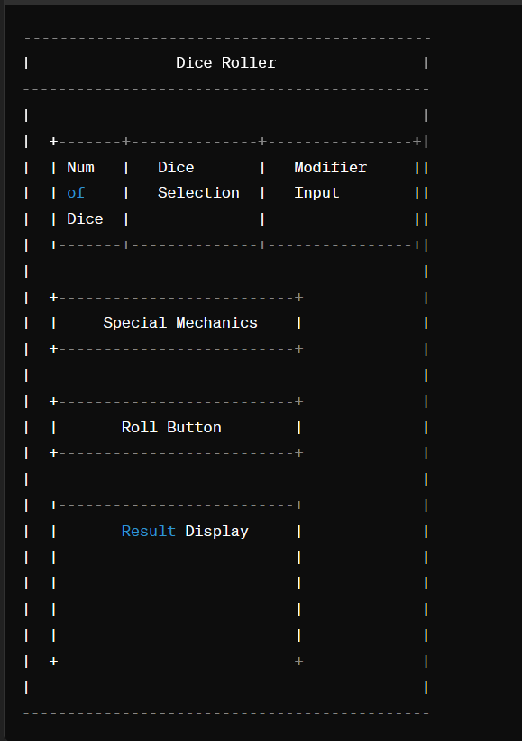

## Project Title: Generalized Tabletop Dice Roller with GUI

# Description:

The Generalized Tabletop Dice Roller with GUI is a versatile command-line tool designed to facilitate dice rolling for various tabletop games, including role-playing games (RPGs), wargames, board games, and more. It allows users to roll different types of dice, apply modifiers, and handle special mechanics such as advantage, disadvantage, critical hits, and fumbles, all within an intuitive graphical user interface.

# Why the Change in Scope?

Originally conceived as a specialized dice roller tailored to Dungeons & Dragons 5th Edition (D&D 5e), the project's scope has been expanded to create a more generalized tool with broader applicability while retaining the GUI aspect. This decision was motivated by several factors:

1. Scalability: A generalized dice roller offers greater scalability, allowing for potential integration with a wider range of tabletop games beyond D&D 5e. This enhances the tool's utility and appeal to a broader audience of tabletop gaming enthusiasts.

2. Flexibility: By accommodating various types of dice, modifiers, and mechanics, the generalized dice roller provides users with greater flexibility to customize their gaming experience according to the rules and mechanics of different games.

3. Usability: The inclusion of a graphical user interface enhances the usability and accessibility of the tool, making it more intuitive and user-friendly for players of all experience levels.

4. Learning Opportunity: Embracing a more generalized scope, while incorporating GUI development, provides an opportunity to explore and implement a wider array of features and functionalities, thereby enhancing learning and skill development in software development and project management.

# Project Requirements:

1. Functionality:
    - Implement core functionality for rolling dice of different types (e.g., d4, d6, d8, d10, d12, d20, d100).
    - Support modifiers such as bonuses, penalties, and multipliers.
    - Integrate a graphical user interface (GUI) for intuitive interaction with the tool.
    - Ensure seamless integration between GUI components and core functionality.

2. Scalability:
    - Design the tool to be adaptable and scalable for potential integration with a wide range of tabletop games.
    - Allow users to customize dice rolls, modifiers, and mechanics according to the rules and mechanics of different games.
    - Maintain flexibility to accommodate future updates and enhancements.

3. Usability:
    - Develop an intuitive and user-friendly graphical user interface (GUI) for seamless interaction with the tool.
    - Provide clear instructions and tooltips within the GUI to guide users on how to navigate and use the tool effectively.
    - Conduct usability testing to gather feedback from users and iterate on the design to enhance usability and accessibility.

4. Documentation:
    - Create comprehensive documentation, including a README.md file, to provide an overview of the tool, installation instructions, usage guidelines, and examples.
    - Update the documentation to reflect any changes in scope or functionality and to address user feedback and suggestions.
    - Ensure that the documentation is clear, concise, and accessible to users of all experience levels.

# GUI layout concept will be removed:
---------------------------------------------
|                Dice Roller                |
---------------------------------------------
|                                           |
|  +-------+--------------+----------------+|
|  | Num   |   Dice       |   Modifier     ||
|  | of    |   Selection  |   Input        ||
|  | Dice  |              |                ||
|  +-------+--------------+----------------+|
|                                           |
|  +--------------------------+             |
|  |     Special Mechanics    |             |
|  +--------------------------+             |
|                                           |
|  +--------------------------+             |
|  |       Roll Button        |             |
|  +--------------------------+             |
|                                           |
|  +--------------------------+             |
|  |       Result Display     |             |
|  |                          |             |
|  |                          |             |
|  |                          |             |
|  |                          |             |
|  +--------------------------+             |
|                                           |
---------------------------------------------
